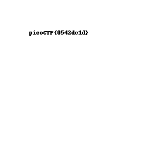

# Pixelated

## Problem

> I have these 2 images, can you make a flag out of them? scrambled1.png scrambled2.png

* [scrambled1.png](./scrambled1.png)
* [scrambled2.png](./scrambled2.png)

## Solution

1. Add the two images together to get the flag. This approach can be seen in the solution [script](./script.py).

2. Here is the result when the images are added together: 

### Flag

`picoCTF{0542dc1d}`
