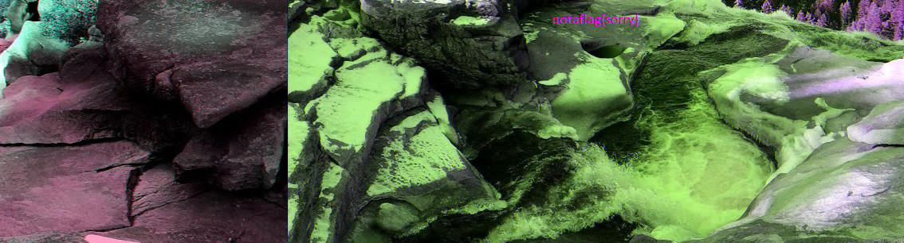
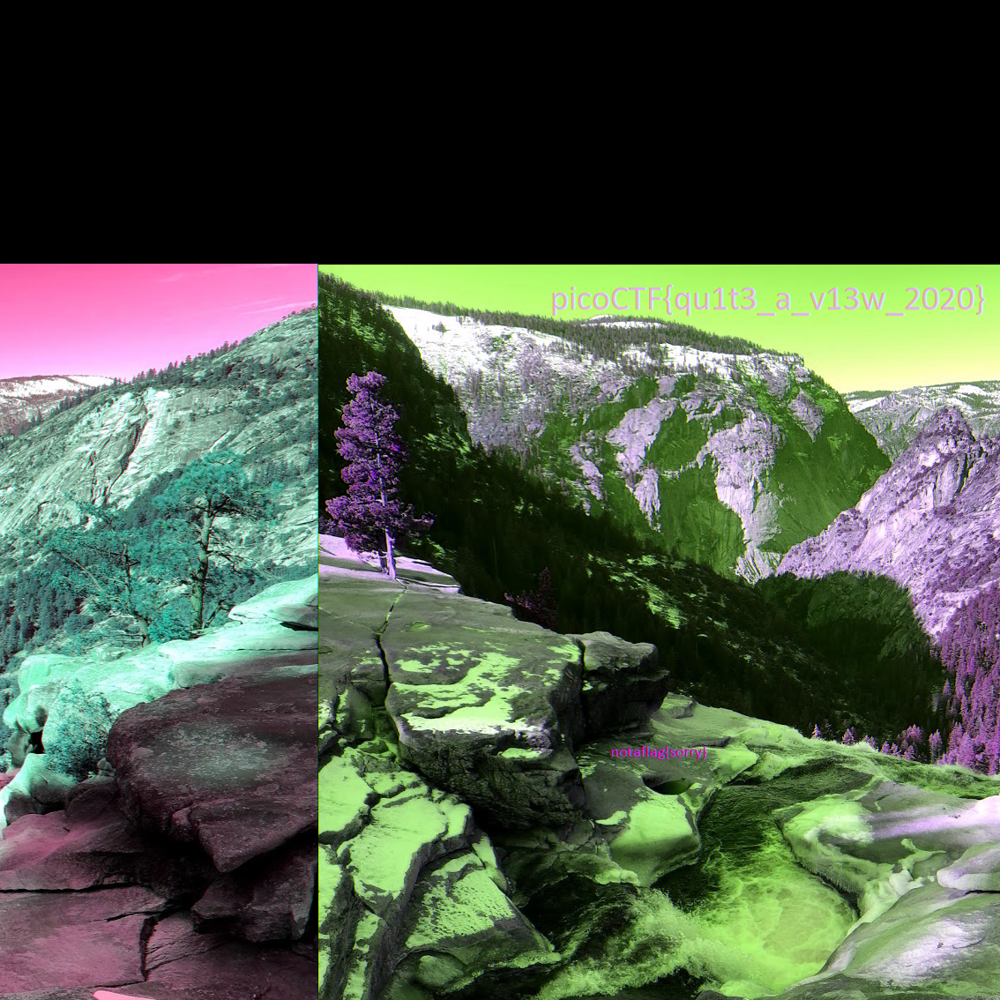

# tunn3l v1s10n

## Problem

> We found this file. Recover the flag.

* [file](./tunn3l_v1s10n)

## Solution

1. There is a problem opening the file. Running `file tunn3l_v1s10n` produces `tunn3l_v1s10n: data`, which is not helpful. We can check a [list of file signatures](https://en.wikipedia.org/wiki/List_of_file_signatures) and see if there is a match between the magic bytes. We can see the first bytes in the `tunn3l_v1s10n` file using `xxd -g 1 tunn3l_v1s10n | head`:

    ```
    00000000: 42 4d 8e 26 2c 00 00 00 00 00 ba d0 00 00 ba d0  BM.&,...........
    00000010: 00 00 6e 04 00 00 32 01 00 00 01 00 18 00 00 00  ..n...2.........
    00000020: 00 00 58 26 2c 00 25 16 00 00 25 16 00 00 00 00  ..X&,.%...%.....
    00000030: 00 00 00 00 00 00 23 1a 17 27 1e 1b 29 20 1d 2a  ......#..'..) .*
    00000040: 21 1e 26 1d 1a 31 28 25 35 2c 29 33 2a 27 38 2f  !.&..1(%5,)3*'8/
    00000050: 2c 2f 26 23 33 2a 26 2d 24 20 3b 32 2e 32 29 25  ,/&#3*&-$ ;2.2)%
    00000060: 30 27 23 33 2a 26 38 2c 28 36 2b 27 39 2d 2b 2f  0'#3*&8,(6+'9-+/
    00000070: 26 23 1d 12 0e 23 17 11 29 16 0e 55 3d 31 97 76  &#...#..)..U=1.v
    00000080: 66 8b 66 52 99 6d 56 9e 70 58 9e 6f 54 9c 6f 54  f.fR.mV.pX.oT.oT
    00000090: ab 7e 63 ba 8c 6d bd 8a 69 c8 97 71 c1 93 71 c1  .~c..m..i..q..q.
    ```

2. The `42 4d` match with a BMP image. We can open this image in [Photopea](https://www.photopea.com/), since it is able to load the image. However, all we see is a weird warped image and a fake flag.

    

3. We can change the height of the bitmap using a hex editor such as [HexEd.it](https://hexed.it/). The width starts at hex offset `12`, lasts for 4 bytes, and is followed by the height at offset `16`, which is also 4 bytes. The info is on the [BMP Wikipedia page](https://en.wikipedia.org/wiki/BMP_file_format) under the "Windows `BITMAPINFOHEADER`".

4. Let's set the height to the same number as the width (`6e 04`) since the image looks like part of it was extended outwards. We make the change in the hex editor replacing `32 01` at offset `16` to `6e 04`, save the image, and then load it in [Photopea](https://www.photopea.com/).

    

### Flag

`picoCTF{qu1t3_a_v13w_2020}`
