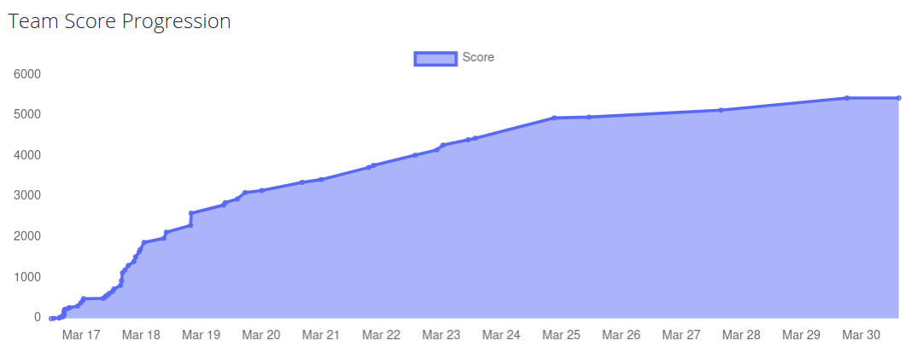

# HHousen PicoCTF-2021 Writeup

Write-ups for various challenges from the 2021 [picoCTF competition](https://play.picoctf.org/events/34).

During the competition period, which was held between March 16th, 2021 and March 30th, 2021, I placed **25 out of 2280** (**top 1.1%**) among US Middle/High School students (who solved at least one challenge) as a **solo player** with a score of **5440 points**.

Not every challenge has a corresponding writeup. I did not do any writeups for any of the challenges in the "General Skills" category since they were mostly for beginners. Additionally, there are a few challenges that I have not solved yet. I plan to complete them soon.

